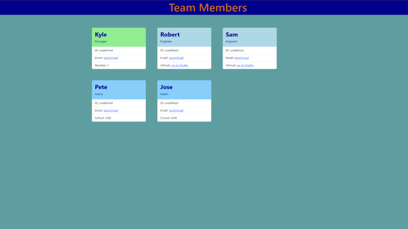

# Team builder


## Description

This is a Team Profile Generator. This program uses the prompts in the terminal to ask questions of the users team to help build an html page of the users team. The application uses Jest for test and Inquirer  to collect the users information.  

### Table of Contents

- [Installation](#installation)
- [Usage](#usage)
- [Technologies](#technologies)
- [User-Story](#user-story)
- [Acceptance-Criteria](#acceptance-criteria)
- [Screenshots](#screenshots)
- [CodeSnippets](#codeSnippets)
- [License](#license)
- [Contributors](#contributors)
- [Tests](#tests)
- [Questions](#questions)

## Installation

install Inquirer and Jest with NPM

## Usage

- Using the command line run npm index.js. 
- Answer all the prompts.
- When finished added employee select not to add any more in the prompts.
- The HTML page will automatically generate in the Dist folder.
- Open the HTML file in a browser and you will have a functional webpage.

## Technologies

- **Jest.js**
- **Inquirer.js**
- **Bootstrap**
- **JavaScript**
- **HTML**
- **CSS**

## Learning-Objectives

- Create scalable application through OOP
- Create object with constructors
- Become accustom to test driven development
- Learn about inheritance

## User Story

```md
AS A manager
I WANT to generate a webpage that displays my team's basic info
SO THAT I have quick access to their emails and GitHub profiles
```

## Acceptance Criteria

```md
WHEN I start the application
THEN I am prompted to enter the team manager’s name, employee ID, email address, and office number
WHEN I enter the team manager’s name, employee ID, email address, and office number
THEN I am presented with a menu with the option to add an engineer or an intern or to finish building my team
WHEN I select the engineer option
THEN I am prompted to enter the engineer’s name, ID, email, and GitHub username, and I am taken back to the menu
WHEN I select the intern option
THEN I am prompted to enter the intern’s name, ID, email, and school, and I am taken back to the menu
WHEN I decide to finish building my team
THEN I exit the application, and the HTML is generated
GIVEN a command-line application that accepts user input
WHEN I am prompted for my team members and their information
THEN an HTML file is generated that displays a nicely formatted team roster based on user input
WHEN I click on an email address in the HTML
THEN my default email program opens and populates the TO field of the email with the address
WHEN I click on the GitHub username
THEN that GitHub profile opens in a new tab
```

## Screenshots



## CodeSnippets

### Tests the Manager Object with Jest.js

```JavaScript
describe('Manager Test', () => {
	test('create a new manager and test the different values', () => {
		const manager = new managerTest("Robert Smith", 1,"cure@gmail.com", "867-5309");
        expect(manager.getName).toEqual("Robert Smith");
        expect(manager.getEmail).toEqual('"mailto: cure@gmail.com"');
        expect(manager.getOfficeNumber).toEqual("867-5309");
        expect(manager.getId).toEqual(1);
        expect(manager.getRole).toEqual("Manager");
	});
});
```

### Creates a new employee

```JavaScript
function generateRole() {
	inquirer.prompt(employeeQuestions[2]).then((employeeInfo) => {
		if (employeeInfo.role === 'Engineer') {
			generateQuestions(employeeInfo.role);
		} else if (employeeInfo.role === 'Intern') {
			generateQuestions(employeeInfo.role);
		} else if (employeeInfo.role === 'do not add any more to your team'){
			const htmlFile = generateHTML(employeeList);
			fileSystem.writeFile('./dist/index.html', htmlFile, (err) => {
				console.log(err);
			});
		}
	});
}

```

## License

The license used on this project was MIT license

[license link](https://opensource.org/licenses/MIT)

## Contributors

Kyle Vance

## Tests

Jest was used for all testing

## Questions

If you have any questions regarding this project, please reach me by email at vanceofalifetime@protonmail.com

[Video Link](https://drive.google.com/file/d/1cxPXwK-qerZZVJT_8dGR0MmjCNeV9jdb/view)

[LinkedIn](https://www.linkedin.com/in/kyle-s-vance/)
